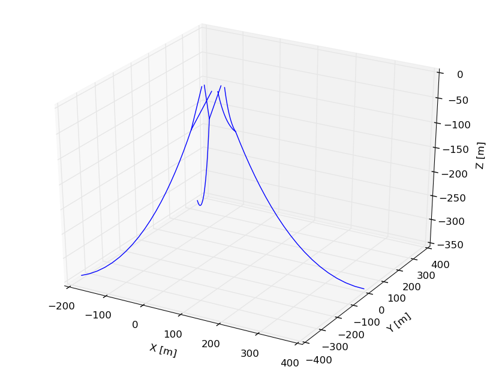

Python Example
==============
.. _quick_start:

Static Configuration
--------------------

This example will be run against the :ref:`baseline input file <baseline_example>`. 
The water depth is :math:`350` meters. 
The space preceeding the ``repeat 120 240`` solver option flag is removed to enable duplication of the mooring geometry twice with :math:`120^\circ` and :math:`240^\circ` offsets about the :math:`Z` axis. 

.. literalinclude:: ../../python_driver/sphinx_example.py
   :language: python

Output
~~~~~~

Two outputs are produced executing the stript above. 
Information explicitly requested is printed to the command line:

.. code-block:: bash

   MAP++ environment properties (set externally)...
       Gravity constant          [m/s^2]  : 9.81
       Sea density               [kg/m^3] : 1025.00
       Water depth               [m]      : 350.00
       Vessel reference position [m]      : 0.00 , 0.00 , 0.00
   
   Linearized stiffness matrix with 0.0 vessel displacement:
   
   [[  1.99e+04  -3.78e-03   5.19e-03  -4.89e-02  -2.00e+05  -1.77e-02]
    [  1.18e-03   1.99e+04  -1.06e-02   2.00e+05   3.50e-02  -6.17e-01]
    [  2.49e-03  -1.01e-03   2.27e+04   2.21e-03   2.23e-01  -2.12e-01]
    [  1.95e-03   2.00e+05  -7.14e-03   1.70e+08   5.78e-03  -3.01e+01]
    [ -2.00e+05   3.33e-04   4.85e-01  -4.89e-02   1.70e+08  -2.19e-02]
    [  8.83e-04  -5.59e-01   1.12e-03  -5.44e+01  -7.06e-02   1.21e+08]]
   
   Linearized stiffness matrix with 5.00 surge vessel displacement:
   
   [[  1.96e+04  -4.75e-03   1.17e+03   4.63e-02  -2.15e+05  -2.02e-03]
    [ -3.30e-03   2.07e+04   7.58e-03   1.81e+05   5.86e-02   1.72e+03]
    [  1.17e+03   8.71e-04   2.32e+04  -3.67e-02  -1.19e+04   8.90e-02]
    [ -2.10e-03   2.00e+05  -2.70e-03   1.70e+08  -9.22e-02  -3.00e+01]
    [ -2.00e+05   1.93e-03   4.91e-01   6.13e-02   1.70e+08  -2.49e-02]
    [  1.12e-03  -5.60e-01   2.96e-03  -5.43e+01   7.27e-02   1.21e+08]]
   Line 0: H = 651461.23 [N]  V = 1178548.28 [N]
   Line 0: Fx = -651461.22 [N]  Fy = 117.69 [N]  Fz = 1178548.28 [N]

A figure is also produced to show the mooring geometry with a :math:`5` meter vessel offset:

    Fig. 7
    
    .. raw:: html

	
<i><b>
	Vessel kinematic breakdown to describe fairlead position relative to the origin.
	</b></i>

Time-Marching for Dynamics Simulation
-------------------------------------

Output
~~~~~~

.. figure:: nstatic/time_domain_1.png
    :align: center
    :width: 60%

    Fig. 8
    
    .. raw:: html

	
<i><b>
	Mooring footprint
	</b></i>

.. figure:: nstatic/time_domain_2.png
    :align: center
    :width: 60%

    Fig. 9
    
    .. raw:: html

	
<i><b>
	Precribed displacement of the vessel fed to MAP++.
	</b></i>

.. figure:: nstatic/time_domain_3.png
    :align: center
    :width: 60%

    Fig. 10
    
    .. raw:: html

	
<i><b>
	Fairlead line tensions for the respective lines. 
	</b></i>

